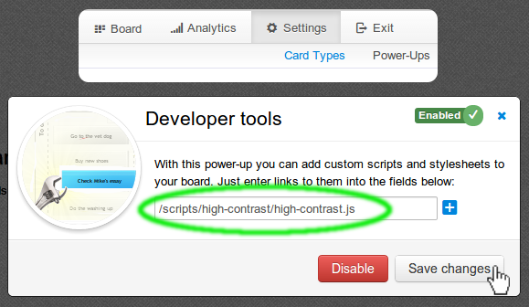

# Collection of useful scripts
This repository contains growing collection of simple scripts which can be loaded with the Developer Tools power-up in [Kanban Tool](http://kanbantool.com).

## How to use them?
Go to the *Board Settings* > *Power-ups* page, and enable the *Developer Tools* power-up.
Once you do that, you should see a form allowing you to specify links to external scripts.

Please select scripts from the table below, and copy-paste the URLs.

## Available scripts

Name | Description | Configuration | `___ Copy links from this column ___`
--- | --- | --- | ---
[Swimlane Auto-Assign](swimlane-auto-assign/) | Automatically assign tasks to team members basing on the swimlane's name.| Swimlane name needs to include team member's name. | [/scripts/swimlane-auto-assign/swimlane-auto-assign.js](/swimlane-auto-assign/swimlane-auto-assign.js)
[Large font](large-font/) | Makes the font on cards slightly larger. | No configuration required. | Medium font: [/scripts/large-font/medium-font.css](/large-font/medium-font.css)   Large font:  [/scripts/large-font/large-font.css](/large-font/large-font.css)
[Card tilt](card-tilt/) | More natural alignment of cards. | No configuration required. | [/scripts/card-tilt/card-tilt.js](/card-tilt/card-tilt.js)
[Delete all](delete-all/) | Adds delete all option to the context menu. | No configuration required. | [/scripts/delete-all/delete-all.js](/delete-all/delete-all.js)
[Fixed cards height](fixed-cards-height) | Makes all cards the same height. | No configuration required. | [/scripts/fixed-cards-height/medium-cards.css](/fixed-cards-height/medium-cards.css)
[Save and done](save-done/) | Adds "Save and move to done" option to the card footer. | No configuration required. | [/scripts/save-done/save-done.js](/save-done/save-done.js)
[Show all settings](show-all-settings/) | Shows all 'settings tabs' to the right of settings. | No configuration required. | [/scripts/show-all-settings/show-all-settings.js](/show-all-settings/show-all-settings.js)
[Task done](task-done/) | Adds "Task done" option to the context menu | No configuration required. | [/scripts/task-done/task-done.js](/task-done/task-done.js)
[Change column](change-column/) | Adds change column option to the context menu. | No configuration required. | [/scripts/change-column/change-column.js](/change-column/change-column.js)
[Cycle time](cycle-time/) | Display time elapsed from when task was created. | No configuration required. | [/scripts/cycle-time/cycle-time.js](/cycle-time/cycle-time.js)
[Order highlight](order-highlight/) | Highlight columns where card order does not match priorities. | No configuration required. | [/scripts/order-highlight/order-highlight.js](/order-highlight/order-highlight.js)
[User avatars](user-avatars/) | Adds support for avatar images. | Script needs to be manually modified, by listing avatar image URL for each users' initials. |
[Card opacity](card-opacity/) | Makes cards more transparent | No configuration required. | [/scripts/card-opacity/card-opacity.js](/card-opacity/card-opacity.js)
[Card saturation](card-saturation/) | Makes the cards color less intense | No configuration required. | [/scripts/card-saturation/card-saturation.css](/card-saturation/card-saturation.css)
[Checklist progressbar](checklist-progressbar/) | Adds progressbar to cards with checklist | No configuration required. | [/scripts/checklist-progressbar/checklist-progressbar.js](/checklist-progressbar/checklist-progressbar.js)
[Column images](column-images/) | Adds images to columns | Script needs to be manually modified, by listing image URL for each column. | [/scripts/column-images/column-images.js](/column-images/column-images.js)
[Large board headers](large-board-headers/) | Makes the font on board headers larger. | No configuration required. | [/scripts/large-board-headers/large-board-headers.css](/large-board-headers/large-board-headers.css)
[Large interactive checklist](large-interactive-checklist/) | Makes the font on interactive checklist slightly larger. | Interactive Checklist Power-Up needs to be enabled. | [/scripts/large-interactive-checklist/large-interactive-checklist.css](/large-interactive-checklist/large-interactive-checklist.css)
[No archive](no-archive/) | Hides archive from context menu for users who are not account admins | No configuration required. | [/scripts/no-archive/no-archive.js](/no-archive/no-archive.js)
[No change priority](no-change-priority/) | Hides option to change priority from context menu | No configuration required. | [/scripts/no-change-priority/no-change-priority.js](/no-change-priority/no-change-priority.js)
[Shorter swimlanes](shorter-swimlanes/) | Makes the swimlanes shorter | No configuration required. | Only empty swimlanes shorter: [/scripts/shorter-swimlanes/shorter-empty-swimlanes.css](/shorter-swimlanes/shorter-empty-swimlanes.css)   All swimlanes shorter and scroll if needed (for Google Chrome only):  [/scripts/shorter-swimlanes/shorter-swimlanes.css](/shorter-swimlanes/shorter-swimlanes.css)
[Column background](column-background/) | Adds background color to columns | Script needs to be manually modified, by selecting colors for each column. | [/scripts/column-background/column-background.js](/column-background/column-background.js)
[Task dependencies highlight](task-dependencies-highlight) | Highlights dependent tasks | No configuration required. | [/scripts/task-dependencies-highlight/task-dependencies-highlight.js](/task-dependencies-highlight/task-dependencies-highlight.js)