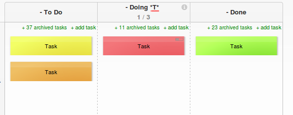
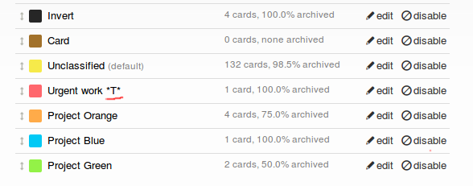

# Color card transition
Change color card if is staying too long (30 minutes) in one column

# Overview
You should add "\*T\*" (string between apostrophes) to workflow stage name and the same string to color card name.
If tasks staying without any actions in selected column longer than 30 minutes color card will change to selected color.

