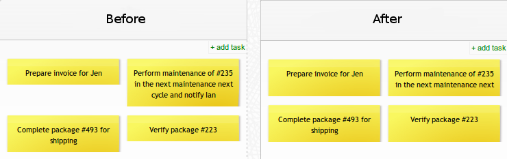

# Fixed cards height
Makes all cards the same height.

# Overview
This script blocks the auto-scaling feature of cards, making them all the same height.
It may be particularly useful when you have wide columns with tasks of different height - with this scripts cards will all appear next to each other without spaces in between them.

## Available scripts

Name | Description | `___ Copy links from this column ___`
--- | --- | --- | ---
[Small cards](small-cards.css) | Cards which can hold just a single line of text. | [/scripts/fixed-cards-height/small-cards.css](https://kanbantool.com/scripts/fixed-cards-height/small-cards.css)
[Medium cards](medium-cards.css) | Cards which can hold two lines of text. | [/scripts/fixed-cards-height/medium-cards.css](https://kanbantool.com/scripts/fixed-cards-height/medium-cards.css)
[Large cards](large-cards.css) | Cards which can hold three lines of text. | [/scripts/fixed-cards-height/large-cards.css](https://kanbantool.com/scripts/fixed-cards-height/large-cards.css)
[XL cards](xlarge-cards.css) | Cards which can hold four lines of text. | [/scripts/fixed-cards-height/xlarge-cards.css](https://kanbantool.com/scripts/fixed-cards-height/xlarge-cards.css)

