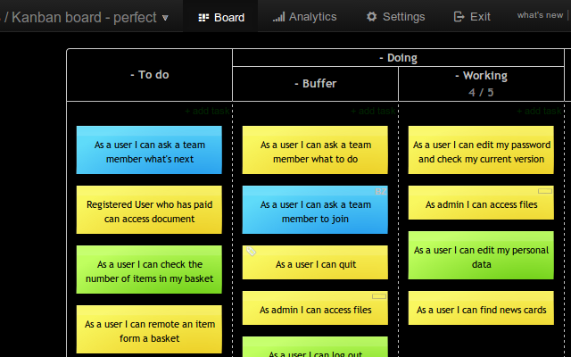

# High contrast boards
Make you board look nice on large displays and TV screens.

# Overview
Light colors used in Kanban Tool usually do not look nice when displayed on large TV screens.
This script adds another option to the ```tools``` menu, which changes the default colors into high-contrast ones.


