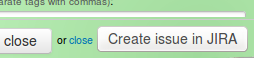
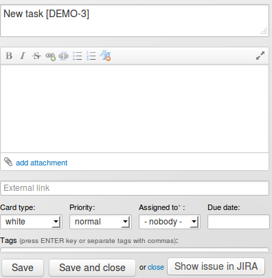
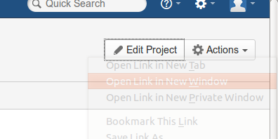
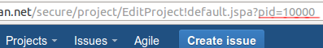
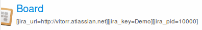

# Kanbanira
Fast script for basic integration with Jira.

# Overview
Kanbanira allows for basic integration with Jira and adds the following:

- hyperlink to Jira project on top menu

- A button in all tasks for faster creation of new issues in Jira (if button was clicked a form for creation of new issue in jira will open in new window)

- A button for quick view of related issue in Jira (if button was clicked an issue will open in new window) Please note that this requires to add to task name key issue in square brackets -> [DEMO-2])

# Installation
All steps are required for this script to work properly.

Jira account link and project details need to be added to board description in Kanban Tool. All attributes should be in square brackets with key and value -> [key=value]

This script requires 3 attributes:

- Jira account url

  [jira_url=http://YOUR_ACCOUNT.atlassian.net]
  Required is full url.

- Project key

  [jira_key=PROJECT_KEY]
  You can find project key in jira on dashboard project next to logo.

  

- Jira project ID

  [jira_pid=10000]

  This step is only for project administrator in jira.
  Go to project administration and find 'Edit project', next you should open edit form in new window (click right mouse button and select 'Open link in new window').

  

  Next go to new opened window and look at URL, you should see on the end URL ?pid=xxxxxx for example: https://your_project.atlassian.net/secure/project/EditProject!default.jspa?pid=10000

  

All attributes in board description should look like this:

# More information
This script is based on Kanbanira extension for Chrome browser and usage is very similar but initialization is different.
You can see how work Kanbanira extension in demonstration video:

