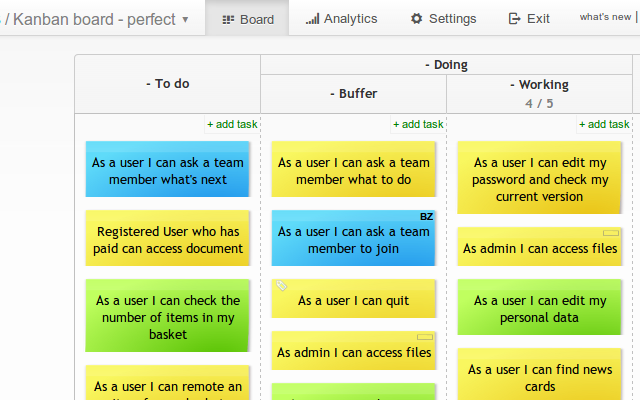

# Larger font on cards
Make the default font larger.

# Overview
Some people think that the default font on cards is too small. With these scripts you can fine tune it's size.
Use ```medium-font.css``` to make the font slightly bigger, and ```large-font.css``` to make it extra large.

You can mix this script with [High contrast](../high-contrast/) to get even better experience on TV screens.


