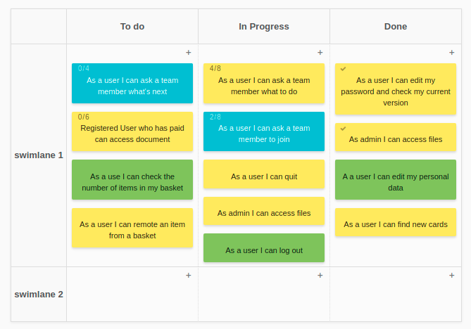
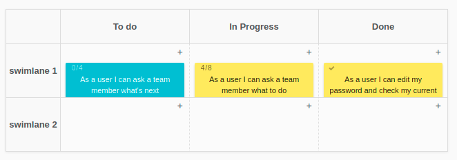

# Shorter swimlanes
Make the swimlanes shorter.

# Overview
You can make the swimlanes shorter with these scripts. Use ```shorter-empty-swimlanes.css``` to make empty swimlanes shorter,
and ``shorter-swimlanes.css``` to make it all shorter with scroll (for Google Chrome only).




