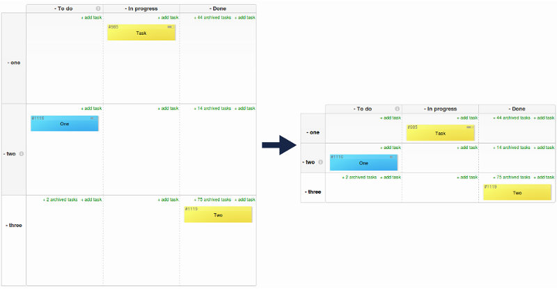

# Swimlane height
Reduces minimal swimlane height

# Overview
Minimal height of swimlane is equals few tasks height, even for empty cell. This script reduces minimal swimlanes
height and saving area on your board.

